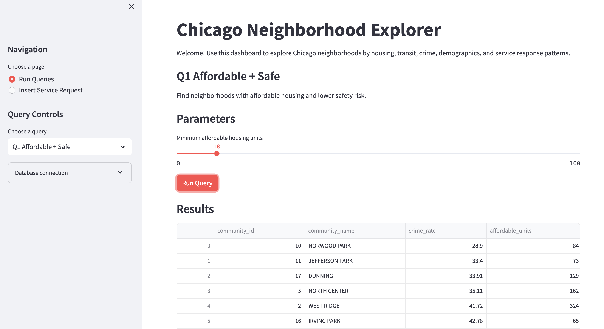
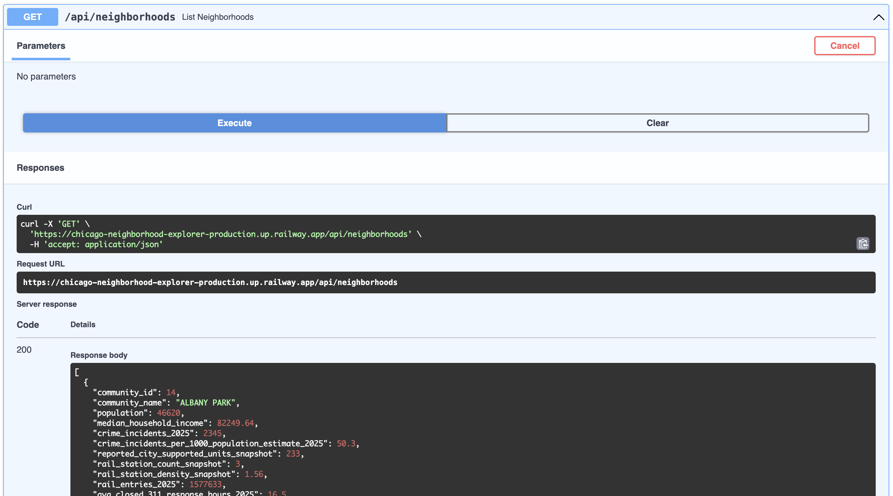

# Chicago Neighborhood Analytics Platform

Full-stack analytics platform built on 2M+ Chicago open-data records covering
77 community areas across crime, transit, housing, demographics, and civic
service metrics.

FastAPI · MySQL · Streamlit · Docker · Pytest · GitHub Actions

## Live Demo

Deployment target: Railway.

The Railway demo can use the lightweight processed dataset in `db-data/chicago_neighborhood_data/`, while the benchmark report documents optimization over the full local 2.1M+ source-row database.

```text
Live Demo: https://authentic-solace-production.up.railway.app
API Docs: https://chicago-neighborhood-explorer-production.up.railway.app/docs
Backend Health: https://chicago-neighborhood-explorer-production.up.railway.app/health
```




## Project Overview

Chicago Neighborhood Analytics Platform is a backend-focused full-stack project
that exposes a curated MySQL analytics database through FastAPI REST endpoints.
The system was refactored from a monolithic Streamlit application into a
client-server architecture: the Streamlit frontend now communicates with the
backend over HTTP and no longer accesses MySQL directly.

The project emphasizes production-style software engineering practices:

- REST API design over SQL views and analytical queries
- API-first refactor from direct database calls to service boundaries
- FastAPI dependency injection for testable database access
- Pydantic response schemas for typed API contracts
- Dockerized frontend/backend application services
- mocked pytest coverage that runs without MySQL
- GitHub Actions CI for automated compile and test checks

## Resume Highlights

- Built a full-stack analytics platform over 2M+ Chicago open-data records covering 77 community areas.
- Refactored a monolithic Streamlit application into a client-server architecture using FastAPI REST APIs.
- Containerized frontend and backend services with Docker Compose.
- Developed automated API tests and GitHub Actions CI without requiring a live MySQL instance.

## Architecture

```text
Browser
  |
  v
Streamlit Frontend
  |
  | REST API
  v
FastAPI Backend
  |
  | SQL Views / Queries
  v
MySQL Analytics Database
```

The frontend is intentionally decoupled from the database. All data access flows
through the FastAPI backend, which owns MySQL connection management and query
execution.

Docker Compose runs only the application layer:

```text
frontend container ---> api container ---> local MySQL on host machine
```

## Tech Stack

- Python 3.10
- FastAPI
- Streamlit
- MySQL 8.0
- mysql-connector-python
- pandas, GeoPandas, Shapely
- Pydantic
- Docker / Docker Compose
- pytest
- GitHub Actions

## Key Features

- REST API layer exposing neighborhood, crime, transit, and comparison resources.
- API-first frontend refactor: Streamlit consumes HTTP endpoints instead of MySQL.
- FastAPI dependency injection for mockable database sessions.
- Pydantic schemas defining stable response contracts.
- Docker Compose setup for frontend/backend services.
- Automated pytest suite covering success, error, validation, and schema cases.
- GitHub Actions CI that runs without MySQL, Docker, or external services.

## API Endpoints

| Method | Endpoint | Purpose |
| --- | --- | --- |
| `GET` | `/health` | API and database connectivity check |
| `GET` | `/api/neighborhoods` | List neighborhood profile summaries |
| `GET` | `/api/neighborhoods/{community_id}` | Get one neighborhood detail profile |
| `GET` | `/api/neighborhoods/{community_id}/crime` | Get 2025 crime breakdown for one community area |
| `GET` | `/api/neighborhoods/{community_id}/transit` | Get transit stations/ridership for one community area |
| `GET` | `/api/compare?ids=1,2,3` | Compare selected community areas |
| `GET` | `/api/wards` | List ward IDs for frontend controls |
| `GET` | `/api/queries/{query_key}` | Run legacy analytical query through the API |
| `POST` | `/api/service-requests` | Preserve the existing service-request insert form |

Interactive docs:

```text
http://localhost:8000/docs
```

## Local Setup

Install dependencies:

```bash
pip install -r requirements.txt
```

Create a local `.env` from the template:

```bash
cp .env.example .env
```

Set values for your existing MySQL database:

```bash
MYSQL_HOST=127.0.0.1
MYSQL_PORT=3306
MYSQL_USER=root
MYSQL_PASSWORD=YOUR_PASSWORD
MYSQL_DATABASE=chicago_neighborhood
API_BASE_URL=http://localhost:8000
```

Start the API:

```bash
uvicorn api.main:app --reload
```

Start the frontend in another terminal:

```bash
streamlit run app/app.py
```

Open:

```text
http://localhost:8000/docs
http://localhost:8501
```

## Docker Setup

Docker Compose containerizes the FastAPI and Streamlit services only. It does
not start or manage MySQL. Your local MySQL database must already contain the
schema, views, indexes, and Chicago datasets.

For Docker Desktop, set the API's database host to the host machine:

```bash
MYSQL_HOST=host.docker.internal
```

Run:

```bash
docker compose up --build
```

Legacy Compose command:

```bash
docker-compose up --build
```

Verify:

```text
http://localhost:8000/docs
http://localhost:8501
```

## Railway Deployment

The full deployment workflow, including Railway MySQL import/export, lives in
[docs/railway_deployment.md](docs/railway_deployment.md).

If you do not have your local MySQL root password, use the processed-CSV demo import path described there instead of `mysqldump`.

## Testing and CI

Run tests locally:

```bash
pytest
```

The test suite mocks the FastAPI database dependency and does not require a
running MySQL server, Docker, or loaded data. Current coverage includes:

- health endpoint
- neighborhood list/detail endpoints
- compare endpoint
- 200 and 404 responses
- invalid compare IDs
- response schema shape

GitHub Actions workflow:

```text
.github/workflows/ci.yml
```

CI runs on `push` and `pull_request`, installs dependencies, compiles Python
files, and runs `pytest`.

## Query Performance

Performance analysis for the main API SQL paths is documented in:

```text
docs/query_performance_analysis.md
```

When MySQL is running, generate live timing and `EXPLAIN` output with:

```bash
python3 scripts/analyze_query_performance.py --runs 10
```

## Database Notes

Base tables:

```text
community_areas
census_profiles
management_companies
housing_developments
crime_records
cta_rail_stations
cta_lines
serves
rail_ridership_monthly
service_requests
wards
community_area_ward_overlap
```

Derived views:

```text
vw_crime_aggregation
vw_neighborhood_profile
vw_ward_community_profile
```

Create/load commands are available for local development:

```bash
python3 etl/load_database.py --create-schema --create-indexes
python3 etl/validation.py
```

Create or refresh the profile snapshot used by the main API endpoints:

```bash
mysql -u root -p chicago_neighborhood < sql/05_create_profile_snapshot.sql
```

The snapshot keeps `vw_neighborhood_profile` intact and refreshes
`neighborhood_profile_snapshot` from the view.

Manual SQL files live in `sql/`, and demo SQL is in `sql/04_demo_queries.sql`.

## Future Improvements

- Add Redis cache-aside layer.
- Add query performance benchmarking using `EXPLAIN ANALYZE`.
- Add production logging and uptime monitoring.
- Add API pagination and filtering.
- Add integration tests.
- Add role-based authentication for production-style access.
- Add OpenAPI examples for all response schemas.
